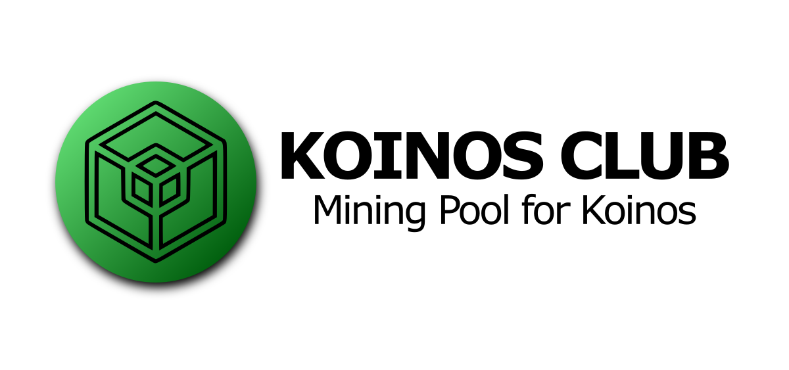

[](https://github.com/joticajulian/koinos-miner/issues)
[](https://github.com/joticajulian/koinos-miner/blob/master/LICENSE.md)

# Koinos Miner: Wolf Edition

This miner has been enhanced with some great features, you can read more about them under the section **Getting Started**.

For the official version from OpenOrchard, please go [here](https://github.com/open-orchard/koinos-miner). 

OpenOrchard have given their green-light for the idea behind this miner version! 👍 They, however, have not verified nor checked the code nor are they affiliated with this version. I am using it extensively myself, but there *could* be bugs.

## Quickstart with Docker

[Privex](https://www.privex.io) regularly publishes automated docker image builds to DockerHub under the image [privex/koinos-miner](https://hub.docker.com/repository/docker/privex/koinos-miner) - these are pre-built container images that can be downloaded in just 1 to 3 minutes on fast 100mbps+ connections that contain the mining software preinstalled and ready to use.

When you reference the image `privex/koinos` with Docker, it should automatically download it from DockerHub for you - no need to manually install it.

Using Docker, you should be able to run the miner on most platforms, needing only Docker itself installed.

```sh
# If you don't yet have Docker installed, you can install it on Ubuntu 18.04 / 20.04 from apt
apt update -qy
apt install -y docker.io

# You can specify your private key as an environment variable directly on the command line using '-e' for the fastest non-interactive
# setup. It may be more secure however, to keep the privateKey inside of a .env file.
# Replace the example private key (f3416...) and eth address (0x419b) with your own eth address and private key.
docker run -e privateKey=f3416f83f4b34379b6bcb50187f3f96171626540983958f01187f76f9c63a49c --name koinos --rm -itd privex/koinos-miner -a 0x419b2E6af0Ed913DB7acF54BbCbE62cea6880D2c --use-env

# Alternatively, you can store your private key in a .env file. Simply create a plain text file somewhere secure, for example,
# inside of the root user's home folder.
nano /root/koinos.env

# Add the following line to the file (replace xxxxxxx with your actual private key)
privateKey=xxxxxxxxxx

# Close and save the file by pressing CTRL-X
# Now we can use that env file with docker:
docker run --env-file /root/koinos.env --name koinos --rm -itd privex/koinos-miner -a 0x419b2E6af0Ed913DB7acF54BbCbE62cea6880D2c --use-env

# You can limit the number of CPU cores that the miner uses, by passing --cpus or --cpuset-cpus
# The below example limits the miner container to 4 cores - it may occasionally switch the cores that it uses,
# but will be limited to a maximum of 4 cores
docker run --cpus 4 --env-file /root/koinos.env --name koinos --rm -itd privex/koinos-miner -a 0x419b2E6af0Ed913DB7acF54BbCbE62cea6880D2c --use-env

# By using --cpuset-cpus we can restrict the miner to specific numbered CPU cores (starting from 0, meaning 0 is your first core)
# In the below example, the miner will be limited to cores 0 to 2 (0+1+2), 5, and 8 to 10 (8+9+10).
# This can be used to improve performance if you know certain cores are slower than others (e.g. thread cores on intel CPUs)
docker run --cpuset-cpus=0-2,5,8-10 --env-file /root/koinos.env --name koinos --rm -itd privex/koinos-miner -a 0x419b2E6af0Ed913DB7acF54BbCbE62cea6880D2c --use-env
```

To stop the miner:

```
docker stop koinos
```

To check the logs of the miner

```
docker logs --tail=100 koinos
```

To follow the logs in realtime as it prints them (hit CTRL-C to exit the log follower):

```
docker logs --tail=100 -f koinos
```


## Table of Contents
  - [Dependencies](#dependencies)
  - [Installation](#installation)
  - [Getting Started](#getting-started)
  - [Example Run](#example-run)
  - [FAQ](#FAQ)

## Dependencies

Prior to installation, you'll need to install the necessary dependencies.

### Linux (Debian based)

```
sudo apt-get install git cmake build-essential libssl-dev
```

### macOS

On macOS, installing `gcc` is required to support OpenMP parallelization. Using the `brew` package manager, install OpenSSL and gcc.
```
brew install openssl gcc cmake
```

### Windows

On Windows, ensure that you are using the `MingW` compiler and you have installed `CMake`. Using the cholocately package manager, install OpenSSL.

```
choco install openssl
```

## Installation

For both Windows and Linux, you should be able to simply invoke the standard `npm` installer.

```
npm install
```

For macOS, you will need to specify the C compiler as `gcc`.

```
CC=gcc-10 npm install
```

For macOS, you also might need to set the correct openssl directory:

```
#1: Find your local ssl path (example: /usr/local/Cellar/openssl@1.1 or /usr/local/Cellar/openssl)
#2: Open package.json, change "postinstall" to "postinstall:other" and "postinstall:osx" to "postinstall"
#3: Look at "postinstall" and change the ssl paths for "DOPENSSL_ROOT_DIR" and "DOPENSSL_LIBRARIES". The second path is the same as the first just with "/lib" at the end
```

## Getting started

You can view the CLI miner arguments by using `npm` like so:

```
npm start -- --help
```

And get the following output:

```sh
❯ npm start -- --help

> koinos-miner@1.0.4 start /path/to/koinos-miner
> node app.js "--help"

Usage: app [OPTIONS]...

Options:
  -v, --version                      output the version number
  -a, --addr <addr>                  An ethereum address
  -e, --endpoint <endpoint>          An ethereum endpoint (default: "wss://ropsten-rpc.linkpool.io/ws")
  -e, --pool-endpoint <pool endpoint>  A mining pool endpoint (default: "https://api.koinos.club")
  -t, --tip <percent>                The percentage of mined coins to tip the developers (default: "5")
  -p, --proof-period <seconds>       How often you want to submit a proof on average (default: "86400")
  -k, --key-file <file>              AES encrypted file containing private key
  -m, --gas-multiplier <multiplier>  The multiplier to apply to the recommended gas price (default: "1")
  -l, --gas-price-limit <limit>      The maximum amount of gas to be spent on a proof submission (default: "1000000000000")
  -l, --gwei-limit <limit>           [NEW] The maximum amount of gas in gwei unit to be spent on a proof submission (default: "1000")
  -l, --gwei-minimum <minimum>       [NEW] The minimum amount of gas in gwei unit to be spent on a proof submission (default: "15")
  -s, --speed <speed>                [NEW] How fast should the transaction be: slow | medium | optimal | fast | fastest (default: "optimal")
                                     (https://fees.upvest.co/estimate_eth_fees)`
  --import                           Import a private key
  --export                           Export a private key
  --no-pool                          Do not use a mining pool
  --use-env                          [NEW] Use private key from .env file (privateKey=YOUR_PRIVATE_KEY)
  --wolf-mode                        [NEW] Using this option is going to reward 1% (or --tip if > 0) of your mined coins to the maintainer of this version
  -h, --help                         display help for command

```

**Recipient Address**: The `--addr` argument specifies the recipient address, this is where KOIN will be rewarded.

**Ethereum Endpoint**: The `--endpoint` argument specifies the Ethereum node to be used when querying contract information. This endpoint is also used to submit proofs when "no-pool" option is present.

**Pool Endpoint**: The `--pool-endpoint` argument specifies the url to connect with the mining pool api.

**Developer Tip**: The `--tip` argument specifies the percentage of rewarded KOIN to donate to the Koinos Development Team. Possible values are 0% or 5%.

**Speed [NEW]**: The `--speed` arguments determines how fast should the transaction be: slow | medium | optimal | fast | fastest (https://fees.upvest.co/estimate_eth_fees) - (default: optimal => golden middle between medium and fast)

**Gas Multiplier**: The `--gas-multiplier` argument specifies a multiplier to apply to the calculated gas price. This can be used to get your proofs submitted when the Ethereum network gas fees are spiking or are unpredictable.

**Proof Period**: The `--proof-period` argument specifies the number of seconds on average the miner will attempt to mine and submit proofs. Consult the active miners on https://koinos.club and consider to use one the proof periods listed there in order to be inserted in a group and reduce transaction fees.

**Gas Multiplier**: (Not applicable if using mining pool) The `--gas-multiplier` argument specifies a multiplier to apply to the calculated gas price. This can be used to get your proofs submitted when the Ethereum network gas fees are spiking or are unpredictable.

**Gas Price Limit**: (Not applicable if using mining pool) The `--gas-price-limit` argument specifies a cap in the acceptable gas price for a proof submission.

**Gwei Limit [NEW]**: The `--gwei-limit` argument specifies a cap in the acceptable gas price (in gwei unit) for a proof submission.

**Gwei Minimum [NEW]**: The `--gwei-minimum` argument specifies the minimum amount of gas (in gwei unit) to be paid for a proof submission.

- *Info:* `--gwei-limit` and `--gwei-minimum` were added later to make it easier, as gwei prices are simpler to read. To provide backwards compatability, `--gas-price-limit` is still supported and will be used if `--gwei-limit` is not set. However, `--gwei-price-limit` is recommended.
- 1 Gwei = 1000000000 Gas (https://eth-converter.com/)
- A more detailed explanation of the different miner configurations can be found in the [Koinos GUI Miner](https://github.com/open-orchard/koinos-gui-miner) `README.md`.

## Key Management

(Not applicable if using mining pool)

The CLI miner provides the arguments `--import`, `--export`, and `--key-file`. These are used in handling the private key of the funding address. The user may import a private key and optionally store it in a key file in which case exporting the key is now possible.

If you know what you're doing, you can also use `--use-env` to get the key from an `.env` file:

```
echo privateKey=YOUR_PRIVATE_KEY | tee .env
```

## Example Run

A simple example of running the miner:

```
❯ npm start -- --endpoint http://mining.koinos.io --addr 0x98047645bf61644caa0c24daabd118cc1d640f62 --use-env --speed optimal --tip 5 --proof-period 20000 --gwei-minimum 30 --wolf-mode

> koinos-miner@1.0.3 start /path/to/koinos-miner
> node app.js "--endpoint" "http://mining.koinos.io" "--addr" "0x98047645bf61644caa0c24daabd118cc1d640f62" "--use-env" "--speed" "optimal" "--proof-period" "20000" "--gwei-minimum" "30" "--tip" "5" "--wolf-mode"

 _  __     _                   __  __ _
| |/ /    (_)                 |  \/  (_)
| ' / ___  _ _ __   ___  ___  | \  / |_ _ __   ___ _ __
|  < / _ \| | '_ \ / _ \/ __| | |\/| | | '_ \ / _ \ '__|
| . \ (_) | | | | | (_) \__ \ | |  | | | | | |  __/ |
|_|\_\___/|_|_| |_|\___/|___/ |_|  |_|_|_| |_|\___|_|
------------- Version 1.0.4 (Wolf Edition) -------------
--------------------------------------------------------

[JS](app.js) Mining with the following arguments:
[JS](app.js) Ethereum Receiver Address: 0x98047645bf61644caa0c24daabd118cc1d640f62
[JS](app.js) Ethereum Miner Address: 0x9d2DfA86488fSSF1f41bC02CE94C74Bb0dE47Da6
[JS](app.js) Ethereum Endpoint: http://mining.koinos.io
[JS](app.js) Proof every 6h (20000)
[JS](app.js) Open Orchard Developer Tip: 5%
[JS](app.js) Wolf Mode Engaged! Gracias!


❯ npm start -- --addr 0x98047645bf61644caa0c24daabd118cc1d640f62
```

## Docker

You can run the miner using docker. Image size optimized to 250 MB:

```
docker run privex/koinclub:latest
```

# FAQ

## Should I enter my private key in the miner?

No. You just need to provide the address where you want to receive the mined koins. The mining pool will take care of submitting the proofs to the blockchain.

## How can I mine using the mining pool?

Send a minimum amount of 0.02 ETH to 0x5c3365898a31a8b0bf90d84ef93245e56570eef9 to add it to your balance in the pool (check your balance at https://koinos.club). Then start the miner.

## How the mining pool can reduce the transaction fees?
All miners are divided in groups of 5, and each group is working on a specific target. When a proof is found only 1 transaction is submitted and it includes the 5 miners are benefiaries. Then the transaction fees, plus a fee for the pool, are shared between. Each miner can reduce up to 60% in transaction fees with this model.

## How I know if I'm in a group of 5 miners?
Check the logs of your miner and look for a list of miners. For instance, in this example there are 3 miners in a group:
```
...
[C] Buffer: 3 0xbbd1f77c6759a17752105e9af7d10f38ebbb3ab9 0x8c09525132adbb9bacdd62eb26970b400eb8f493 0x6487c30a3a148acc85fc31250cd53e55ed92c802 0x0000000000000000000000000000000000000000 0x0000000000000000000000000000000000000000 4391 3472 2137 0 0 0xe64ea68f85f992efad6806652d0ebb39a198bcfdfce1d7d2d96faccc5f4edb58 11270144 0x0000000036cfebde5da992b610b10f4fbff79767579aa30b8d23855b77febbb6 0x000001355d281789015ca71bc5fe2ca3ee68c1f443494418d9ce0bb0db19cdbf 1 115693 55532886 0xe64ea68f85f992efad6806652d0ebb39a198bcfdfce20006487ce900010b23b5;
[C] Miners:
      0xbbd1f77c6759a17752105e9af7d10f38ebbb3ab9 percent 4391
      0x8c09525132adbb9bacdd62eb26970b400eb8f493 percent 3472
      0x6487c30a3a148acc85fc31250cd53e55ed92c802 percent 2137
[C] Ethereum Block Hash: 0xe64ea68f85f992efad6806652d0ebb39a198bcfdfce1d7d2d96faccc5f4edb58
[C] Ethereum Block Number: 11270144
[C] Difficulty Target:         0x0000000036cfebde5da992b610b10f4fbff79767579aa30b8d23855b77febbb6
[C] Partial Difficulty Target: 0x000001355d281789015ca71bc5fe2ca3ee68c1f443494418d9ce0bb0db19cdbf
[C] PoW Height: 1
[C] Thread Iterations: 115693
[C] Hash Limit: 55532886
[C] Start Nonce: 0xe64ea68f85f992efad6806652d0ebb39a198bcfdfce20006487ce900010b23b5
...
```
## Can I use several miners with the same address?
Yes. You can set several miners. The mining pool will take care of assigning different tasks to each one in order to optimize the resources. All the hashing power is added to a group of miners in order to receive 1 single payment when submitting proofs.

## I have this error: Insufficient funds to operate in the pool
You need a minimum of 0.02 ether to operate in the pool. Send eth to 0x5c3365898a31a8b0bf90d84ef93245e56570eef9, wait for 4 or 5 confirmations. If you are still receiving this error go to https://koinos.club and send the transaction id to add it to your balance.

## License

Copyright 2020 Open Orchard, Inc.

Koinos Miner is free software: you can redistribute it and/or modify
it under the terms of the GNU General Public License as published by
the Free Software Foundation, either version 3 of the License, or
(at your option) any later version.

Koinos Miner is distributed in the hope that it will be useful,
but WITHOUT ANY WARRANTY; without even the implied warranty of
MERCHANTABILITY or FITNESS FOR A PARTICULAR PURPOSE.  See the
GNU General Public License for more details.

You should have received a copy of the GNU General Public License
along with Koinos Miner.  If not, see <https://www.gnu.org/licenses/>.
